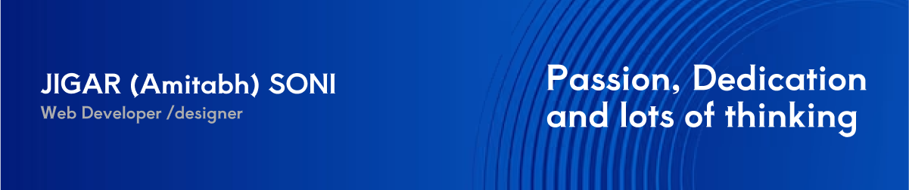

<!--
🌟 GitHub Profile README Template (DevrajDC-style) for @jigarsoni786
Instructions:
1) Put your banner and illustration inside /assets then update the file names below.
2) Find & replace all CAPS placeholders like YOUR_NAME, YOUR_EMAIL, YOUR_PORTFOLIO, etc.
3) Commit this README.md to a repo named exactly your GitHub username: jigarsoni786
-->

  

<h1 align="left">Hello 👋, It's me <strong>JIGAR SONI</strong>! 🤓</h1>

<em>I'm a UI/UX-oriented Web developer.</em>

<!-- Right-side illustration (optional) -->

- 🔭 Currently crafting my Portfolio with passion and precision.
- 🧱 Building Pixel-Perfect Web Interfaces.
- 🌐 Explore my other projects at **YOUR_PORTFOLIO**.
- 💬 Ask me about **Web Development, UI/UX, React, Framer Motion, Figma**.
- 📫 Reach me at **YOUR_EMAIL**.
- 🧾 Dive into my experiences with my **[Resume](https://docs.google.com/document/d/1SeZH_lneyh8ltDdCDWBCIav6RFuWkn2KooMag_-tzTs/edit?usp=sharing)**.
- 🎨 Fun fact: Apart from coding, I'm also an **Artist/Photographer/Video-Editor**!

---

### 🧳 Tech Backpack

<!-- Use skillicons for clean, square-ish tech icons -->

  

---

### 📌 Some of my Repositories
> Tip: Use the **“Customise your pins”** button on your profile to pin up to 6 repos you want to showcase.  
> Suggested pins: Artify-Image-generator • texi-kart • admin-dash • Task-Master • Ecommerce-Checkout-Form • Todo-list-by-jigar-soni • luckshowindia-lottery-result-full-stack

---

### 🤝 Connect with Me

  
  
  
  

---

### 📊 Optional: GitHub Stats (Dark)

  
  

---

Thanks for visiting ✨

